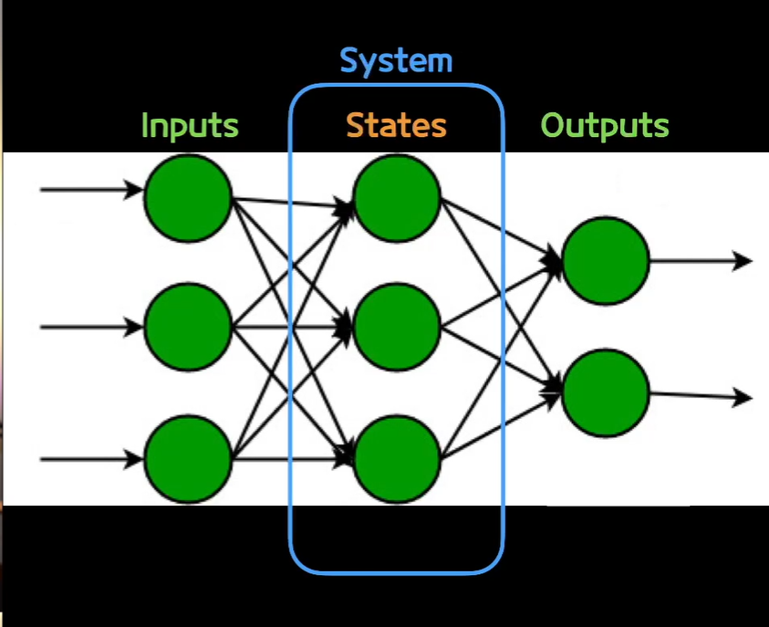
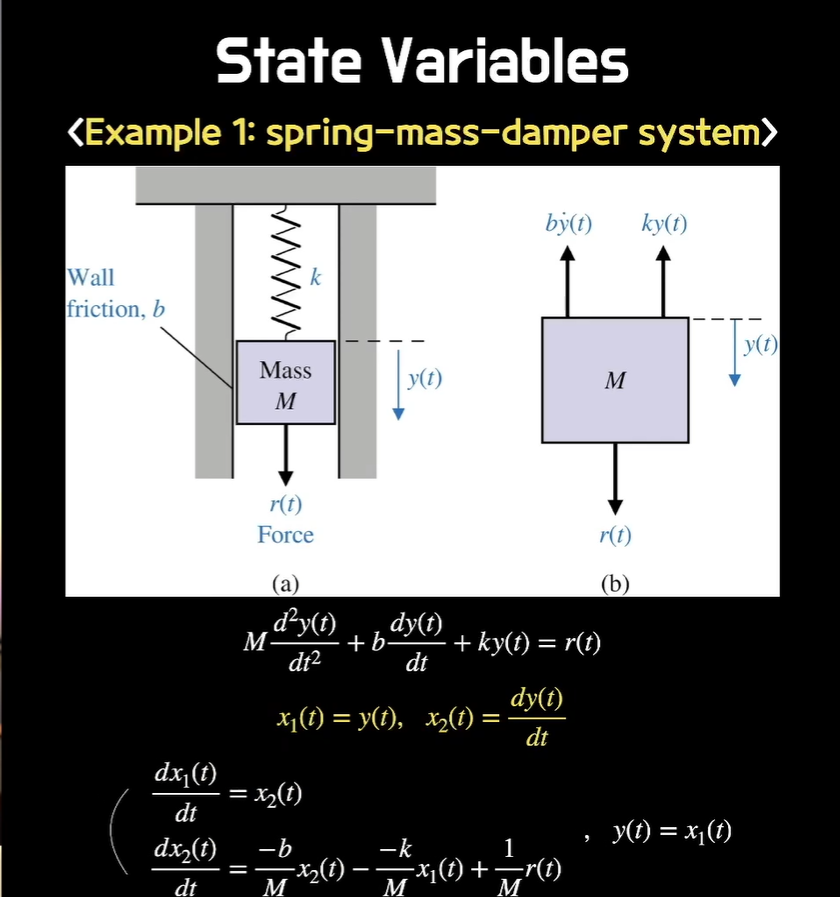
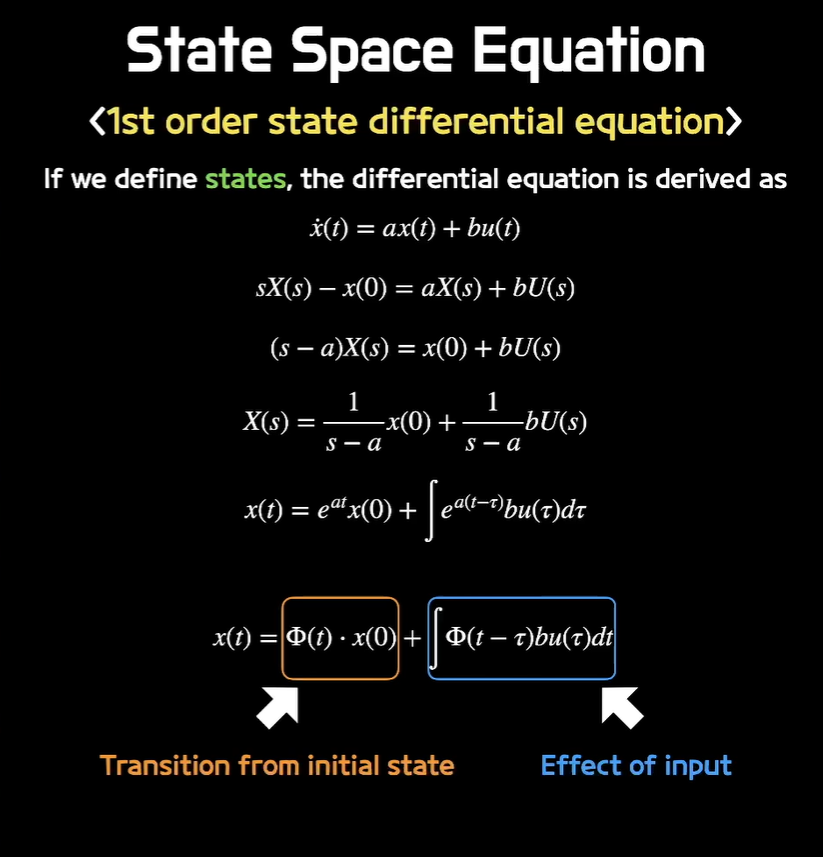

# 5주차 강의 요약  

## State
앞선 수학적 미분방적식을 구성하여 수학적 모델링을 구성하였다. 요번에는 Input과 Output을 두고 그 과정 즉, system의 부분을 States라고 통칭한다. 또한 그 State상에 생기는 변수들을 State Variables라고 한다.   
States Variables의 이 점은   모델링하는 관점에서 조금더 그 과정 System에 집중하는 것을 알 수 있고 결국 우리가 컴퓨터로 코딩을 할 때 중간 과정 상에 변수 설정을 깔끔하게 함으로써 코딩이 수월해진다는 장점을 가지고 있다.  

두 번째 장점으로는 미분방정식을 세울 때 변수화를 통해 방정식을 더 간단하게 표현할 수 있다.

위 사진과 같이 2차 미분방정식을 state variables 설정을 통해 1차 연립 미분 방정식으로 나타내므로써 미분 방정식의 차수를 줄인다는 큰 역할을 한다는 것을 알 수 있다.

## State Space Equation

State Equation은 앞선 State Variables을 정의하고 식으로 정리한 상태이다. 위 사진과 같이 1차 상태 미분 방정식에서는 우변의 1항이 초기값을 나타내고 2항이 Input에 대한 영향을 수식으로 나타내는 것을 볼 수 있다.  
 
이후 Output에 대한 식까지 정리하면 행렬에 대한 식으로 표현이 가능하다.  
이를 통해 컴퓨터에게 코딩으로 일을 시키기에 수월해진다는 장점이 있다.

